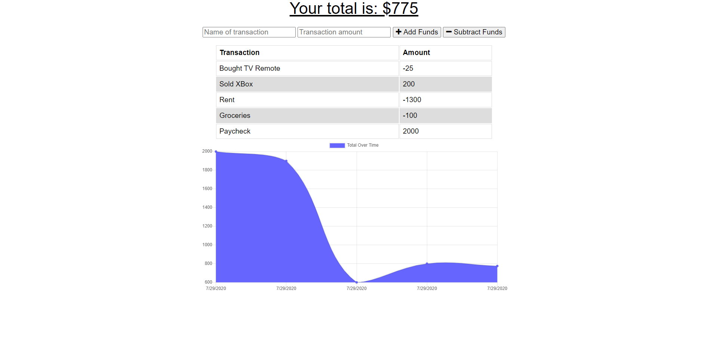

# PWA Budget Tracker
  
  ## Description 
  
  This is a progressive web application that allows you to add and subtract funds from a budget. This app can function both online and offline.
  
  
  ## Table of Contents
  
  * [Installation](#installation)
  * [Usage](#usage)
  * [Contributing](#contributing)
  * [Tests](#tests)
  * [Questions](#questions)
  * [License](#license)
  
  
  ## Installation
  To install this project, open the deployed link provided on your phone. Click the share button on the bottom of the mobile browser and then click add to home screen.
  
  
  ## Usage 
  Use this to track your budget! Add and delete funds to keep track of the total that you have remaining.
  Click the deployed link below to begin using the app!  
  https://shielded-dusk-79353.herokuapp.com/
  
  
  ## Contributing
  Please reach out to me if you would like to contribute at either my github or through my email.
  
  ## Tests
  There are no tests for this project.
  
  
  ## Questions
  If you have any questions, please reach out to me at: ncm297@gmail.com OR github.com/nmitchell34
  
  
  ## License
  
  This project is licensed under the MIT license.
  
  